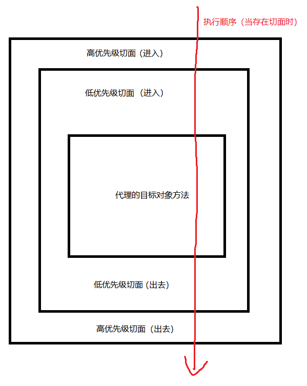

###实战项目笔记：
#####1、Staff-Management-System（员工信息管理系统）
1.1 业务需求：
*  实现根据员工姓名，身份证号，工种，银行账号，开户银行，电话号码等条件
对员工信息进行查询的功能，并在前端用表格的方式展示。
*  实现员工新增、修改功能，并且持久保存，录入系统。
* 使用技术：Spring、Spring-mybatis、Servlet（整合了SpringWeb容器）、ajax、Maven、
Git等等。

1.2 开发中碰到的问题、知识点记录：
  * 前端使用ajax发送请求，访问Servlet
    * 注意区分请求方式、和编码格式
      1. HTTP协议
        * 什么是HTTP协议？
          * 超文本传输协议
          * 浏览器和服务器之间的一种通讯协议
          * 该协议是由W3C负责指定的，其实本质上就是提前制定好了数据传送格式。浏览器和服务器都必须按照这种数据
            格式进行接收和发送。
        * HTTP协议的版本号目前只有HTTP1.1
        * HTTP协议包括几个部分？
          1. 请求协议：从浏览器发送到服务器的时候采用的数据传送格式。
            * 包括四部分组成
              * 请求行（格式：请求方式 URI 协议版本号）如：GET /Staff_Management_System/staffServlet HTTP/1.1
              * 消息报头/请求包头/请求头
              * 空白行：专门用来分离消息报头和请求体的
              * 请求体
          2. 响应协议：从服务器发送到浏览器的时候采用的数据传送格式。
            * 包括四部分组成
              * 状态行（协议版本号 状态码 状态描述信息）如：HTTP/1.1 200 OK
              * 响应报头/响应头
              * 空白行：分离响应包头和响应体
              * 响应体
          3. 响应协议中重点掌握状态码：
            * 200 响应成功正常结束
            * 404资源未找到
            * 500 服务器内部错误
        
      2. 请求方式（GET/POST）：
        1. GET请求和POST请求有什么区别？
          * GET请求在请求行上提交数据，格式：uri?name1=value1&name2=value2....
           这种提交方式最终提交的数据会显示到浏览器的地址栏上（所以会有长度限制）
          * POST请求在请求体中提交数据，相对安全，提交格式：name1=value1&name2=value2....
           这种提交方式最终不会在浏览器地址栏上显示。在请求体中提交数据，所以没有长度限制
           【POST可以提交大数据】
          * GET请求只能提交字符串数据，POST请求可以提交任何类型的数据，包括视频，音频.....,所以文件
           上传必须使用POST请求提交。
          * GET请求最终的结果，会被浏览器缓存收纳，而POST请求最终的结果不会被浏览器缓存。
           
        2. GET请求和POST请求应当如何选择使用？   
          * 有敏感数据，必须使用POST（相对安全）
          * 传送数据不是普通字符串，必须使用POST
          * 传送数据非常多，使用POST 
          * 这个请求是为了修改服务器端资源，使用POST
          * 【重点】GET请求多数情况下是从服务器中读取资源，这个读取的资源在短时间内是不会发生改变的，所以GET
           请求最终的结果浏览器缓存起来了。
          * POST请求是为了修改服务器端的资源，而每一次修改的结果都是不同的，最终结果没有必要被浏览器缓存。
          * 总结一句话：只有读取的时候才有必要使用缓存，修改的时候根本没必须要去缓存，修改的结果。
          
        3. 什么情况下浏览器发送的请求是GET请求？什么情况下浏览器发送的请求是POST请求？
          * 只有当使用表单form，并且将form标签的method属性设置为method="post"(以及人为的设定请求方式
           为POST【如发送ajax指定type为POST、以及后台用httpClient.doPost等等】)，其余剩下所有的请求方式
           都是基于GET方式的（包括点击超链接，以及在浏览器的地址栏输入url访问资源）。
           
        4. 浏览器将资源缓存之后，缓存的资源适合某个特定的路径绑定在一起的，只要再访问这个相同的请求路径，
           这个时候会去缓存中获取资源，不再访问服务器，以这种方式来降低服务器的压力，提高用户的体验。但是有的
           时候，我们不希望走缓存，希望每一次都访问服务器，可以在请求路径后面添加时间戳，
           例如：http://ip:port/oa/system/login?timestamp=123123123【js获取毫秒数：new Date().getTime()】
           
      3. 内容编码方式：（如 application/x-www-form-urlencoded、application/json）      
        * 是指浏览器请求服务器时，用表单，或者发送ajax请求（实际用的仍然是XMLHttpRequest），对传入数据的一种包装格式。
        ajax指定contentType，若为form表单则需要指定enctype属性
            * application/x-www-form-urlencoded：会把数据编码成键=值并且以&分隔的形式，如：flag=selStaff&uname=&idCard=&job=&
              bankAccount=&bankInfo=&telephoneNum=，
              但是这里需要注意，不同的请求方式，数据传输的效果会不一样。
              * GET：会把参数提交在请求行中，并且以?分割uri和参数
                如：http://localhost/Staff_Management_System/staffServlet?flag=selStaff&uname=&idCard=&job=&bankAccount=&bankInfo=&telephoneNum=
              * POST：则会把拼接好格式的数据提交到请求体中 
                ```
                url: http://localhost/Staff_Management_System/staffServlet
                请求体中：
                flag=selStaff&uname=&idCard=&job=&bankAccount=&bankInfo=&telephoneNum=
                ```
            * application/json：会把数据当成json格式的字符串传输，但是在ajax中，如果传入data属性的param是对象类型的话，
              参数仍然会被以“application/x-www-form-urlencoded”的方式编码（此编码非编成2进制数据的那个编码）。所以后端如果
              想接收到json字符串的话，得在调用ajax发送请求得时候把数据转成json字符串（JSON.stringfy()），调用案例如下：
              ```
              var param = {
                flag : $.trim($("#flag").val()),
                uname : $.trim($("#uname").val()),
                idCard : $.trim($("#idCard").val()),
                job : $.trim($("#job").val()),
                bankAccount : $.trim($("#bankAccount").val()),
                bankInfo : $.trim($("#bankInfo").val()),
                telephoneNum : $.trim($("#telephoneNum").val())
              };

                //var paramJson = JSON.stringify(param);
                var paramJson = param;

                $.ajax(
                {
                url: "/Staff_Management_System/staffServlet", //访问路径
                type: "POST",    //访问方式
                // type: "GET",    //访问方式
                data: paramJson, // 发送到服务器的数据。将自动转换为请求字符串格式。
                dataType: "json",   //预期服务器返回的数据类型
                //processData: "true",//不希望将参数自动转换成url?filed1=val1&filed2=val2格式【达不到预期效果】
                // 发送信息至服务器时的内容编码，默认为：application/x-www-form-urlencoded，
                // 即以url?filed1=val1&filed2=val2的格式将参数拼接到url后的编码方式【注意区分，请求方式与编码格式无关】
                contentType: "application/json;charset=utf-8",
                //请求成功时的回调函数
                success : function(data){
                debugger
                alert(data);
                },
                //请求失败时，调用此函数
                error : function (xmlHttpRequest, textStatus, errorThrown) {
                alert(textStatus);
                }
                }
                );
              ```
              
            * 注意：在ajax中，通过data选项传递进来的数据，如果是一个对象(技术上讲只要不是字符串)，都会处理转化成一个查询字符串(如：flag=selStaff&uname=)，
                  （以配合默认内容类型【contentType】 "application/x-www-form-urlencoded"）
              
            * ajax传输数据样例，以及常用属性注释(详细请参照jquery文档)：  
            ```
            $.ajax(
            {
            url: "/Staff_Management_System/staffServlet", //访问路径
            // type: "POST",    //访问方式
            type: "GET",    //访问方式
            data: paramJson, // 发送到服务器的数据。将自动转换为请求字符串格式。
            dataType: "json",   //预期服务器返回的数据类型
            //processData: "true",//不希望将参数自动转换成url?filed1=val1&filed2=val2格式【达不到预期效果】
            // 发送信息至服务器时的内容编码，默认为：application/x-www-form-urlencoded，
            // 即以url?filed1=val1&filed2=val2的格式将参数拼接到url后的编码方式【注意区分，请求方式与编码格式无关】
            contentType: "application/json;charset=utf-8",
            //请求成功时的回调函数
            success : function(data){
            debugger
            alert(data);
            },
            //请求失败时，调用此函数
            error : function (xmlHttpRequest, textStatus, errorThrown) {
            alert(textStatus);
            }
            }
            );
            ```
    * 前端使用ajax或者form表单，后端使用Servlet接收参数案例：
      ```
      案例1：(不指定enctype和contentType，则代表数据得编码格式采取默认【application/x-www-form-urlencoded】)
      1.1 前端写法【form表单】：
      <form method="GET/POST" action="/HelloServlet"><input type="text" name="flag" id="flag" value="selStaff"/></form>
      等价于【ajax写法】
      $.ajax({
        url:"/HelloServlet",
        type:"GET/POST",
        data:{"flag":"selStaff"},
        dataType:"json" //预期服务器返回的数据类型
      });
      
      1.2 请求情况
        1.2.1 GET
        请求行：localhost/HelloServlet?flag=selStaff
        1.2.2 POST
        请求行：localhost/HelloServlet
        请求体：flag=selStaff
      
      1.3 后台用servlet接收：
        request.setCharacterEncoding("utf-8");
        request.getParameter("flag");  //selStaff
      
      案例2：若指定ajax的contentType为（"application/json;charset=utf-8"）
      * 注意：若执行了contentType为application/json，且传递的参数确实是json字符串，那么一定要配合POST请求使用
      否则就会出现把json字符串参数拼接到地址栏的情况(这样去传递肯定就会有问题了)。
      ```
      localhost/HelloServlet?"{"flag"="selStaff"}"
      ```
      2.1 前端ajax写法
      $.ajax({
        url:"/HelloServlet",
        type:"POST",
        data:JSON.stringfy({"flag":"selStaff"}),   //这里传入json字符串
        dataType:"json",
        //请求成功时的回调函数
        success : function(data){
            debugger
            alert(data);
        },
        //请求失败时，调用此函数
        error : function (xmlHttpRequest, textStatus, errorThrown) {
            alert(textStatus);
        }
      });
      
      2.2 请求情况：
      注意：这里不可以用GET方式，否则会出现这种请求：localhost/HelloServlet?{"flag":"selStaff"},请求报错
      POST方式：
      请求行：localhost/HelloServlet
      请求体："{"flag":"selStaff"}"
      
      2.3 后台用servlet接收：
      request.setCharacterEncoding("utf-8");    //只对请求体中的数据有用（Overrides the name of the character encoding used in the body of this request.）
      BufferdReader br = request.getReader();   // 注意：request.getInputStream和request.getReader 只能以输入流的方式返回请求体中的数据
      String str = null;
      StringBuffer sb = new StringBuffer();
      while((str = br.readLine) != null){
          sb.append(str);
      }
      Staff staff = JSON.parseObject(sb.toString(), Staff.class);
      ```
  
  * Spring相关
    * 声明式事务（基于AOP实现的，本质就是AOP）：
      * 注意：凡是涉及到AOP，都需要自行引入依赖包：aspectjweaver
      1. 实现方式（applicationContext.xml中需要配置）：
        * 给定一个数据源（dataSource），用以配置一个事务管理器transactionManager
        ```xml
        <!-- 增加声明式事务 -->
        <bean id="transactionManager" class="org.springframework.jdbc.datasource.DataSourceTransactionManager">
            <property name="dataSource" ref="dataSource"></property>
        </bean>
        ```
      
        * 引用事务管理器（transactionManager），配置事务通知（tx:advice）
        ```xml
        <tx:advice id="txAdvice" transaction-manager="transactionManager">
        <tx:attributes>
            <!--isolation为DEFAULT时：采用数据库默认隔离级别-->
            <!--注意：若tx:method中的方法都匹配的情况下，会使用最精确的配置，
            例如：selStaff会使用sel*配置，而不会使用*的那一条配置-->
            <tx:method name="sel*" read-only="true" propagation="REQUIRED"/>
            <tx:method name="*"/>
        </tx:attributes>
        </tx:advice>
        ```
      
        * 增加切点，以配合事务通知构成事务切面
        ```xml
        <aop:config>
            <aop:pointcut id="txServicePointCut" expression="within(com.demo..impl.*Impl)"/>
            <aop:advisor advice-ref="txAdvice" pointcut-ref="txServicePointCut" order="1"></aop:advisor>
        </aop:config>
        ```
      
        * 注意事项：
            在实战项目练习中，碰到配置了声明式事务但是当连接点发生异常时，却没有发生回滚【碰到这种情况，应该及时配置Spring的日志输出】，
          事务不生效的情况。经分析是由于配置了另外一个处理异常的环绕切面导致的。当发生异常时，环绕切面先捕获到了，并且把异常处理了没有抛出去。
          导致事务切面就没有捕获到异常[本质是没有触发事务的代理对象中的try catch]，以致于没有触发事务进行回滚。
            * 解决方案1：先捕获到异常的切面，接着把异常“扔出来”。
            * 解决方案2（推荐）：设置切面的优先级，切面优先级越高(order数字越小，优先级越高)，越先进入方法，越后走出方法。 
            所以本案例中，将事务切面的优先级设置比环绕切面优先级更低即可。
              
            
            * 设置切面优先级：
                * 方式1：xml中
                ```xml
                <aop:config>
                    <aop:pointcut id="txServicePointCut" expression="within(com.demo..impl.*Impl)"/>
                    <aop:advisor advice-ref="txAdvice" pointcut-ref="txServicePointCut" order="1"></aop:advisor>
                </aop:config>
                ```
                * 方式2：java代码中
                ```java
                @Aspect
                @Component
                public class StaffAspect implements Ordered {
                    @Override
                    public int getOrder() {
                        return 0;
                    }
                }
                ```
    * Spring输出详细日志          
      * 需要添加依赖 + 有log4j.properties(不再重复展示)
      ```xml
        <!-- 日志输出依赖 -->
        <dependencies>
            <dependency>
                <groupId>org.slf4j</groupId>
                <artifactId>slf4j-log4j12</artifactId>
                <version>1.7.25</version>
            </dependency>
            <dependency>
                <groupId>log4j</groupId>
                <artifactId>log4j</artifactId>
                <version>1.2.17</version>
            </dependency>
        </dependencies>
      ```
    
    * mybatis注意事项：
      * 若含有嵌套（参见）的结果集中想要自动映射的字段【不显示声明，mybatis帮我们自动映射同名的，或者满足驼峰的】，需要设置属性：
        ```xml
          <settings>
            <setting name="logImpl" value="LOG4J"/>
            <!-- 开启驼峰映射：A_COLUMN -> aColumn-->
            <setting name="mapUnderscoreToCamelCase" value="true"/>
            <!-- 默认值为：PARTIAL，只会自动映射没有定义嵌套结果映射的字段、
                FULL表示对所有的resultMap都进行自动映射、NONE表示不启用自动映射-->
            <setting name="autoMappingBehavior" value="FULL"/>
          </settings>
        ```
        * 嵌套结果集,如Staff：
        ```java
        @Data
        public class Staff {
            /**
            * 员工工资
            */
            private List<StaffWage> staffWages;
        }
        ```
      * 一对多嵌套结果映射（resultMap）:  
        ```xml
        <!--查询员工信息时，带出员工工资-->
        <mapper>
            <resultMap id="staff_wageMap" type="staff">
            <id column="U_ID" property="uid"></id>
            <collection property="staffWages" ofType="StaffWage">
                <id column="WAGE_ID" property="wageId"></id>
                <result column="WUID" property="uid"></result>
            </collection>
            </resultMap>
            <select id="selStaff" resultMap="staff_wageMap">
                <include refid="staff_columns"/> , wage.WAGE_ID, wage.UID WUID, wage.WAGE, wage.month, wage.YEAR from stuff_info.staff left join
                stuff_info.staff_wage wage on staff.U_ID = wage.UID
            </select>
        </mapper>
        ```
          
    * mappstruct注意事项：
      * 依赖包：
        ```xml
        <dependencies>
            <dependency>
                <groupId>org.mapstruct</groupId>
                <artifactId>mapstruct</artifactId>
                <version>1.4.2.Final</version>
            </dependency>

            <!-- 注解处理器，根据注解自动生成mapper的实现。 -->
            <dependency>
                <groupId>org.mapstruct</groupId>
                <artifactId>mapstruct-processor</artifactId>
                <version>1.4.2.Final</version>
            </dependency>
        </dependencies>
        ```
      * 参考案例（参考博客：https://www.cnblogs.com/mmzs/p/12735212.html）：
        ```java
            // 重点：componentModel="spring" 代表生成的实现类上面会自动添加一个@Component注解，可以通过Spring的 @Autowired方式进行注入
            @Mapper(componentModel="spring")
            public interface StaffTransfer {
                StaffTransfer INSTANCE = Mappers.getMapper(StaffTransfer.class);
                @Mappings({
                    @Mapping(source = "uid", target = "uid"),
                    @Mapping(source = "uname", target = "uname"),
                    @Mapping(source = "idCard", target = "idCard"),
                    @Mapping(source = "job", target = "job"),
                    @Mapping(source = "bankAccount", target = "bankAccount"),
                    @Mapping(source = "bankInfo", target = "bankInfo"),
                    @Mapping(source = "telephoneNum", target = "telephoneNum")
                })
                StaffVO staff2VO(Staff staff);
                List<StaffVO> staff2VOs(List<Staff> staff);
           }
        ```
        
    * 通用返回结果，以及结果枚举状态：
      * Result
        ```java
            @Data
            //lombok 生成全参构造方法
            @AllArgsConstructor
            //lombok 生成无参构造方法
            @NoArgsConstructor
            public class Result<T> {
                private Integer code;
                private String message;
                private T data;
            
                /*public Result(Integer code, String message, T data) {
                    this.code = code;
                    this.message = message;
                    this.data = data;
                }*/
            
                public static Result success(){
                    return new Result(ResultCode.Sucess.getCode(), ResultCode.Sucess.getMessage(), null);
                }
            
                public static <T> Result success(T data){
                    return new Result(ResultCode.Sucess.getCode(), ResultCode.Sucess.getMessage(), data);
                }
            
                public static Result fail(){
                    return new Result(ResultCode.Fail.getCode(), ResultCode.Fail.getMessage(), null);
                }
            
                public static <T> Result fail(String message, T data){
                    return new Result(ResultCode.Fail.getCode(), message, data);
                }
            }
        ```
      * ResultCode
        ```java
        @Getter
        //枚举类上不可以使用lombok的@Setter注解，但是可以加set方法设置枚举类型的值，
        // 但是一般不建议这么干，因为既然是枚举类型，就意味着是列举出来的是保存常量值对象，一般不进行修改
        //@Setter
        public enum ResultCode {
        Sucess(200, "操作成功"),
        Fail(500, "操作失败");
        private Integer code;
        private String message;
        
            private ResultCode(Integer code, String message) {
                this.code = code;
                this.message = message;
            }
        
            /*public Integer getCode() {
                return code;
            }
        
            public void setCode(Integer code) {
                this.code = code;
            }
        
            public String getMessage() {
                return message;
            }
        
            public void setMessage(String message) {
                this.message = message;
            }*/
        
        }
        ```
        
    * 【重点】使用poi实现导出excel功能：
        * poi依赖包：
          ```xml
          <dependencies>
            <dependency>
                <groupId>org.apache.poi</groupId>
                <artifactId>poi</artifactId>
                <version>3.11</version>
            </dependency>
            <dependency>
                <groupId>org.apache.poi</groupId>
                <artifactId>poi-ooxml</artifactId>
                <version>3.11</version>
            </dependency>
            <dependency>
                <groupId>org.apache.poi</groupId>
                <artifactId>poi-ooxml-schemas</artifactId>
                <version>3.11</version>
            </dependency>
          </dependencies>
          ```
        * 代码案例（简化）详细代码参见 ExportExcelUtil -》exportExcel：
            * 首先new一个workbook工作薄，然后通过工作薄创建sheet页签，再通过创建的sheet获取一个row（每一行的数据），最后通过一个
            row获取一个cell（设置每一个确定单元格的数据）。通过上述步骤把工作薄中的数据写入之后，输入文件输出流，调用workbook的write
            方法，把内存中的数据通过IO流写入到硬盘中。  
            ```
            try {
                HSSFWorkbook workbook = new HSSFWorkbook();
                HSSFSheet firstSheet = workbook.createSheet("第一个页签");
                //第一行是表头
                HSSFRow row = firstSheet.createRow(0);
                for (int i = 0; i < headers.length; i++) {
                    HSSFCell cell = row.createCell(i);
                    cell.setCellValue(headers[i]);
                }
                //创建表头之外的值
                for (int i = 1; i <= list.size(); i++) {
                    row = firstSheet.createRow(i);
                    for (int j = 0; j < list.size(); j++) {
                        HSSFCell cell = row.createCell(j);
                        cell.setCellValue(list.get(j));
                    }
                }
                File file = new File("E:\\lihongjieTestExportExcel.xlsx");
                if(!file.exists()){
                    file.createNewFile();
                }
                    workbook.write(new FileOutputStream(file));
                } catch (IOException e) {
                    e.printStackTrace();
                } 
            ```
        * 导出Excel弹出下载框实现：
            * 思路：首先需要有一个“文件目录\文件名”，存放poi输出的中间文件。然后创建输入流，读取这个中间文件，最后设置
              response的header以及contentType。
              * 注意：“文件目录\文件名”中的文件目录和文件，可以使用file.exist()，判断是否存在，若不存在，则可以使用file.mkdir()创建文件目录。
                然后使用file.createNewFile()来创建文件。file.createNewFile()只可以用来创建路径不可以创建文件名。
              * Content-Disposition： 当浏览器接收到头中此属性时，它会激活文件下载对话框，它的文件名框自动填充了头中指定的文件名（filename）。
              * 文件名乱码解决方案：new String(fileName.getBytes("GB2312"), "ISO_8859_1")  
            * 参考案例代码：
            ```
            @Override
            public void exportExcel(HttpServletRequest request, HttpServletResponse response, StaffVO paramVO) {
                Result result = this.selStaff(paramVO);
                List staffVOS = (List<StaffVO>)result.getData();   //需要导出的目标数据
                // 创建文件目录
                File staffDir = new File("E:\\员工信息管理系统excel存放路径");
                if(!staffDir.exists()){
                    staffDir.mkdir();
                }
                Date now = new Date();
                String pattern = "yyyy-MM-DD_HHmmss";
                SimpleDateFormat simpleDateFormat = new SimpleDateFormat(pattern);
                String formatDate = simpleDateFormat.format(now);
                OutputStream fileOutputStream = null;
                BufferedInputStream bis = null;
                BufferedOutputStream bos = null;
                try {
                    String fileName = formatDate + "员工信息" + ".xlsx";
                    File staffFile = new File("E:\\员工信息管理系统excel存放路径\\" + fileName );
                    if(!staffFile.exists()){
                    staffFile.createNewFile();
                    }
                    fileOutputStream = new FileOutputStream(staffFile);
                    exportExcelUtil.exportExcel(fileName,new String[]{"序号", "姓名", "身份证号码", "员工工种",
                    "银行账号", "开户银行", "电话号码", "月份（合集）", "年份", "工资总和"}, staffVOS, fileOutputStream, pattern);
                    // 读取已经处理输出的excel
                    bis = new BufferedInputStream(new FileInputStream(staffFile));
                    byte[] buffer = new byte[bis.available()];
                    bis.read(buffer);
                    // 清空response
                    response.reset();
                    // 设置response的Header
                    //response.setCharacterEncoding("utf-8");
                    // new String(as.getBytes("GB2312"), "ISO_8859_1"); 解决下载文件名乱码问题
                    response.addHeader("Content-Disposition", "attachment;filename=" + new String(fileName.getBytes("GB2312"), "ISO_8859_1"));
                    response.addHeader("Content-Length", "" + staffFile.length());
                    response.setContentType("application/vnd.ms-excel;charset=gb2312");
                    bos = new BufferedOutputStream(response.getOutputStream());
                    bos.write(buffer);
                    bos.flush();
                } catch (IOException e) {
                    e.printStackTrace();
                } finally {
                    // 关闭资源
                }
            }
            ```
          
        * 关于File以及文件输入、输出流
          * File相关
            ```
            //即使该路径和文件不存在，new File也不会报错，只会在构造输入输出流的时候才会报错
            File file = new File("D:\\不存在的文件夹\\不存在的文件.txt");   
            //判断目录、文件是否存在（true存在，false反之）
            file.exists();
            //若不存在，可以使用mkdir()创建目录，createNewFile()创建文件
            file.mkdir(); || file.createNewFile();
            ```
          * 一种新的用输入流读取，用输出流写出的方式：
            * 注意：bis.available()为BufferedInputStream重写的，可以返回输入流的字节长度
            ```
            File file = new File("D:\\xxx\\xx.txt");
            BufferedInputStream bis = new BufferedInputStream(new FileInputStream(file));
            byte[] buffer = new byte[bis.available()];
            bis.read(buffer);
            BufferedOutputStream bos = new BufferedOutputStream(new FileOutputStream);
            bos.write(buffer);
            bos.flush();
            //关闭资源
            ```
            
        * 关于内网穿透：
          * 参照博客：https://www.cnblogs.com/muyouzhi/p/12891731.html
          * 注意：此方式需要一个外网域名（注册花生壳可提供），目前使用idea启动项目的话（除了博客提供的步骤之外，
            还需要配置多个Host，否则idea启动web项目直接报错），不能达到内网穿透的效果。
            只能把web项目编译输出之后，部署到Tomcat的webapps目录下去才可以实现内网穿透的目的。